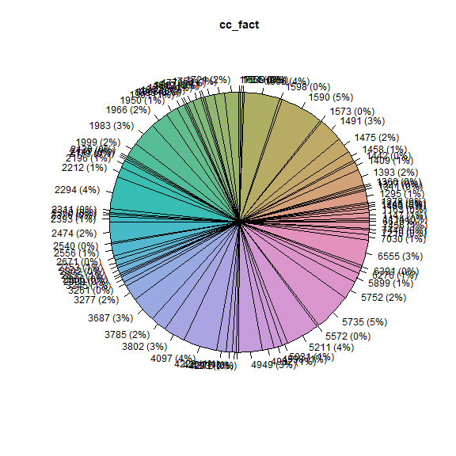
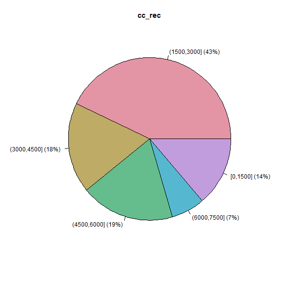
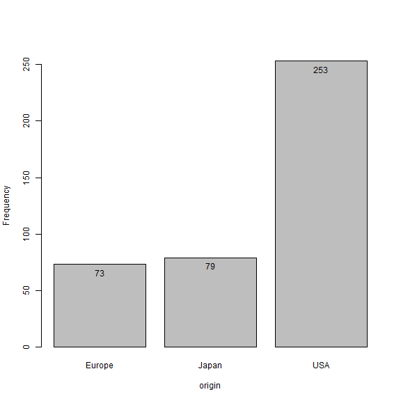
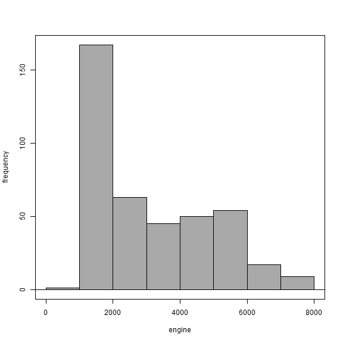
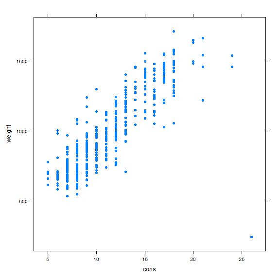
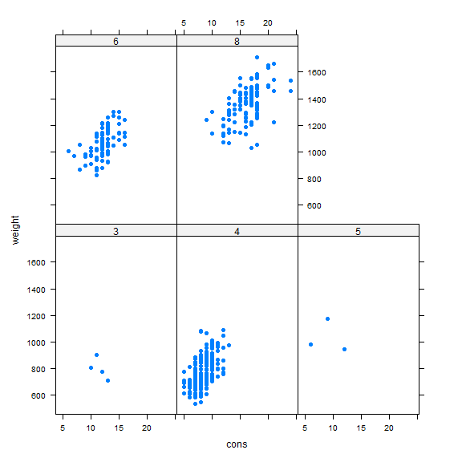
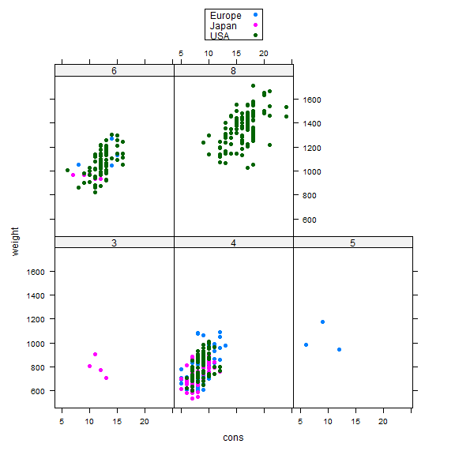

<!-- R Commander Markdown Template -->

PRACTICA3
=======================

### Your Name

### 2025-04-22


```r
> load("C:/Users/Airam/Downloads/RCars_EN (1).RData")
```

grafico de barras y de tarta, por ponerle nombre, se hace todo codificando una variable numerica con intervalos, sino no tiene sentido alguno


```r
> library(colorspace, pos=25)
```


```r
> RCars_en <- within(RCars_en, {
+   cc_fact <- as.factor(engine)
+ })
```


```r
> with(RCars_en, piechart(cc_fact, xlab="", ylab="", main="cc_fact", 
+   col=rainbow_hcl(84), scale="percent"))
```




```r
> RCars_en <- within(RCars_en, {
+   cc_rec <- Recode(cc_fact, 
+   '0:1500="[0,1500]"; 1500:3000="(1500,3000]"; 3000:4500="(3000,4500]"; 4500:6000="(4500,6000]"; 6000:7500="(6000,7500]"; ;',
+    as.factor=TRUE)
+ })
```


```r
> with(RCars_en, piechart(cc_rec, xlab="", ylab="", main="cc_rec", col=rainbow_hcl(5), 
+   scale="percent"))
```


para recodificar una variable, primero convertirla a factor usando numeros, luego ver minimo y maximo para dividir en sectores de igual tamaño, y ahi recodificar y mostrar grafico


```r
> local({
+   .Table <- with(RCars_en, table(cc_rec))
+   cat("\ncounts:\n")
+   print(.Table)
+   cat("\npercentages:\n")
+   print(round(100*.Table/sum(.Table), 2))
+ })
```

```

counts:
cc_rec
(1500,3000] (3000,4500] (4500,6000] (6000,7500]    [0,1500] 
        174          73          76          27          56 

percentages:
cc_rec
(1500,3000] (3000,4500] (4500,6000] (6000,7500]    [0,1500] 
      42.86       17.98       18.72        6.65       13.79 
```


```r
> with(RCars_en, Barplot(origin, xlab="origin", ylab="Frequency", label.bars=TRUE))
```


ahora hemos hecho un grafico de barras para la variable origen


```r
> with(RCars_en, Hist(engine, scale="frequency", breaks="Sturges", col="darkgray"))
```



ahora hemos hecho un histograma para la variable engine

ahora usaremos el grafico XY para varios ejemplos, primero para representar la relacion entre peso y consumo


```r
> library(lattice, pos=26)
```


```r
> xyplot(weight ~ cons, type="p", pch=16, auto.key=list(border=TRUE), 
+   par.settings=simpleTheme(pch=16), scales=list(x=list(relation='same'), 
+   y=list(relation='same')), data=RCars_en)
```



ahora, mismo grafico pero para cada numero de cilindros, convirtiendo a factor dicha variable primero


```r
> RCars_en <- within(RCars_en, {
+   cylind_fact <- as.factor(cylind)
+ })
```


```r
> xyplot(weight ~ cons | cylind_fact, type="p", pch=16, auto.key=list(border=TRUE), 
+   par.settings=simpleTheme(pch=16), scales=list(x=list(relation='same'), 
+   y=list(relation='same')), data=RCars_en)
```



ahora, lo mismo pero para cada origen basandonos en el numero de cilindros


```r
> xyplot(weight ~ cons | cylind_fact, groups=origin, type="p", pch=16, 
+   auto.key=list(border=TRUE), par.settings=simpleTheme(pch=16), 
+   scales=list(x=list(relation='same'), y=list(relation='same')), data=RCars_en)
```




```r
> options(encoding="utf-8")
```


