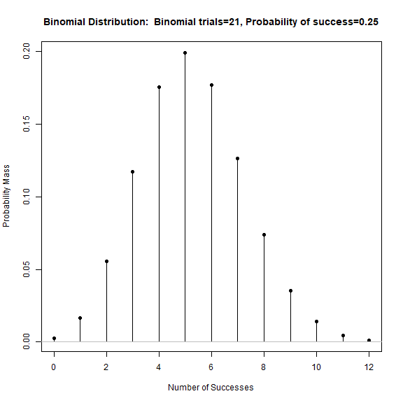
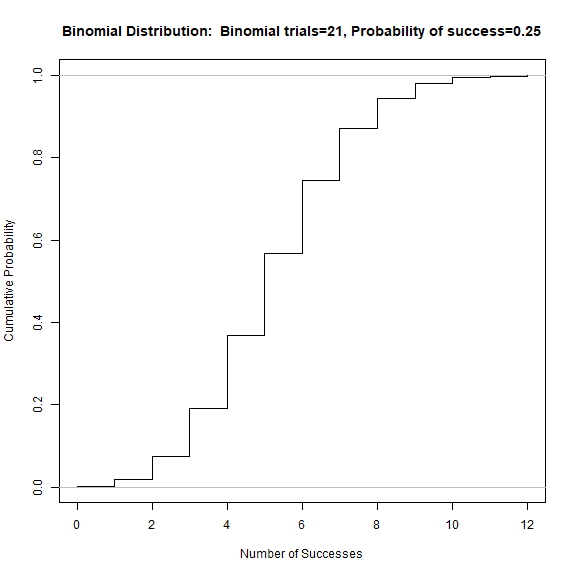
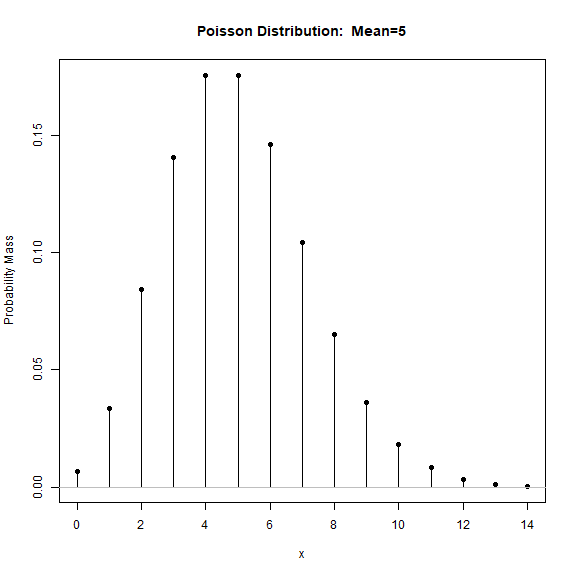
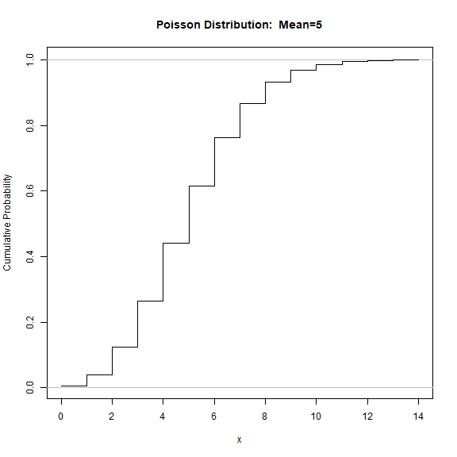
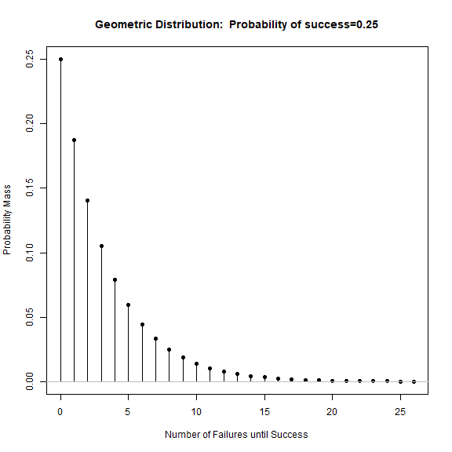

<!-- R Commander Markdown Template -->

PRACTICA 5, DISTRIBUSIONES
=======================

### Your Name

### 2025-06-03


2.Binomial

A multiple choice exam consists of 21 questions, each of which has 4 possible answers.
If a student answers all the questions at random,

a) Determine the distribution of the number of questions answered correctly by the
student.

X:Number of questions answered correctly by the student
X~B(21,0.25)

b) Represent the probability and distribution functions of this variable.

Binomial-function distribution y eso

c) Find the probability that the student just answers correctly to 6 questions. (Ans:
0.1770398).

Binomial-probabilidades binomial, y poner 21 y 0.25, luego buscar el 6

d) Find the probability of passing the exam if it is necessary to answer correctly to at
least 11 questions. (Ans: 0.00642271).

P(X>11)=1-P(X<=11)
Probabilidades Acumuladas hay q darle, valores d la variable, poner 10, y cola derecha xq es P(X>10) para incluir el 11


3.Poisson

The number of accesses per minute to a web site follows a Poisson distribution of
mean 5.


a) Represent the probability and distribution functions of this variable.

Menu, poisson, y meter los valores
X:number of accesses per minute
X~P(5)

b) Find the probability that, in one minute, exactly 4 accesses occur. (Ans: 0.1754673698).

Probabilidad de poisson, media 5, y buscar el 4

c) Find the probability that, in two minutes, the number of accesses will be, at most,
7. (Ans: 0.2202206).

como es el doble, es decir, una poisson mas la otra, porque son 2 minutos, la media es 5, buscamos 
P(X<=7), un lower tail vaya.
Probabilidad acumulada, valores pones 7 y media 10 por lo ya dicho

d) Think about the number of accesses that, at most, will occur in the next minute.
Determine the lowest value that we must give as an answer if we want to be right
with a probability of no less than 0.9. (Ans: 8 accesses)

buscamos el valor tal que P(X<=cK)=0.9, 0.9 es el cuantil.
vamos a cuantiles, 0.9 en probabilidad y pa lante

4.Geometric and negative binomial distribution

Represent the probability function of a geometric distribution with parameter 0.25.
Remember the relationship between the definition for geometric distribution seen in
theory classes and the definition used by R.


Consider the multiple choice exam described in Section 5.2 (binomial distribution)
and assume again that the student answers randomly to all questions:


a) Find the probability that the student gives his first correct answer, in the fourth
question he answers. (Ans: 0.1054687500).

probabilidades, geometrica, 0.25 y sale, en este caso en el 3, que indica que es la ultima respuesta fallada antes de la correcta, que seria la cuarta

b) Find the probability that you will need to answer, at most, 6 questions until you
get a correct answer. (Ans: 0.8220215).

P(X<=6), pero el putisimo R toma 0 como primer valor, asi que habra que buscar para X=5, siempre un valor menos que el que piden

c) Find the probability that the student gives his third correct answer on the sixth
question he answers. (Ans: 0.0659179688).

Binomial negativa, vamos a probabilidades, y en donde pone exitos, ponemos la cantidad de fallos antes del suceso que necesitamos
como nos dice que son 6 preuguntas y hemos fallado 3, buscamos el valor 3

Note: Remember that, when using R, if X ? B?(r, p) then P(X = k), with k ?
{0, 1, 2, . . .}, is the probability that we have k failures before the r-th success.

5.Hipergeometrica


A batch of 20 electronic devices contains five defective devices. If 10 devices are chosen at random, what is the probability that 2 of the 10 devices are defective? (Ans:
0.34829721). Note: If X follows a hypergeometric distribution, R defines P(X = t) as the
probability of finding t white balls among all the balls chosen at random.


N1 es 5
N2 es 15
k es 10


```r
> local({
+   .x <- 0:12
+   plotDistr(.x, dbinom(.x, size=21, prob=0.25), xlab="Number of Successes", 
+   ylab="Probability Mass", 
+   main="Binomial Distribution:  Binomial trials=21, Probability of success=0.25", 
+   discrete=TRUE)
+ })
```




```r
> local({
+   .x <- 0:12
+   plotDistr(.x, pbinom(.x, size=21, prob=0.25), xlab="Number of Successes",
+   ylab="Cumulative Probability", 
+   main="Binomial Distribution:  Binomial trials=21, Probability of success=0.25", 
+   discrete=TRUE, cdf=TRUE)
+ })
```




```r
> local({
+   .Table <- data.frame(Probability=dbinom(0:21, size=21, prob=0.25))
+   rownames(.Table) <- 0:21 
+   print(.Table)
+ })
```

```
    Probability
0  2.378409e-03
1  1.664886e-02
2  5.549621e-02
3  1.171587e-01
4  1.757380e-01
5  1.991697e-01
6  1.770398e-01
7  1.264570e-01
8  7.376657e-02
9  3.551724e-02
10 1.420689e-02
11 4.735631e-03
12 1.315453e-03
13 3.035661e-04
14 5.782212e-05
15 8.994552e-06
16 1.124319e-06
17 1.102273e-07
18 8.164989e-09
19 4.297362e-10
20 1.432454e-11
21 2.273737e-13
```


```r
> qbinom(c(10), size=21, prob=0.25, lower.tail=TRUE)
```

```
Warning in qbinom(c(10), size = 21, prob = 0.25, lower.tail = TRUE): NaNs produced
```

```
[1] NaN
```


```r
> pbinom(c(10), size=21, prob=0.25, lower.tail=TRUE)
```

```
[1] 0.9935773
```


```r
> pbinom(c(10), size=21, prob=0.25, lower.tail=FALSE)
```

```
[1] 0.00642271
```


```r
> local({
+   .x <- 0:14
+   plotDistr(.x, dpois(.x, lambda=5), xlab="x", ylab="Probability Mass", 
+   main="Poisson Distribution:  Mean=5", discrete=TRUE)
+ })
```




```r
> local({
+   .x <- 0:14
+   plotDistr(.x, ppois(.x, lambda=5), xlab="x",ylab="Cumulative Probability", 
+   main="Poisson Distribution:  Mean=5", discrete=TRUE, cdf=TRUE)
+ })
```




```r
> local({
+   .Table <- data.frame(Probability=dpois(0:14, lambda=5))
+   rownames(.Table) <- 0:14 
+   print(.Table)
+ })
```

```
    Probability
0  0.0067379470
1  0.0336897350
2  0.0842243375
3  0.1403738958
4  0.1754673698
5  0.1754673698
6  0.1462228081
7  0.1044448630
8  0.0652780393
9  0.0362655774
10 0.0181327887
11 0.0082421767
12 0.0034342403
13 0.0013208616
14 0.0004717363
```


```r
> qpois(c(7), lambda=10, lower.tail=TRUE)
```

```
Warning in qpois(c(7), lambda = 10, lower.tail = TRUE): NaNs produced
```

```
[1] NaN
```


```r
> qpois(c(7), lambda=10, lower.tail=FALSE)
```

```
Warning in qpois(c(7), lambda = 10, lower.tail = FALSE): NaNs produced
```

```
[1] NaN
```


```r
> ppois(c(7), lambda=10, lower.tail=TRUE)
```

```
[1] 0.2202206
```


```r
> qpois(c(0.9), lambda=5, lower.tail=TRUE)
```

```
[1] 8
```


```r
> local({
+   .x <- 0:26
+   plotDistr(.x, dgeom(.x, prob=0.25), xlab="Number of Failures until Success", 
+   ylab="Probability Mass", main="Geometric Distribution:  Probability of success=0.25", 
+   discrete=TRUE)
+ })
```




```r
> local({
+   .Table <- data.frame(Probability=dgeom(0:26, prob=0.25))
+   rownames(.Table) <- 0:26 
+   print(.Table)
+ })
```

```
    Probability
0  0.2500000000
1  0.1875000000
2  0.1406250000
3  0.1054687500
4  0.0791015625
5  0.0593261719
6  0.0444946289
7  0.0333709717
8  0.0250282288
9  0.0187711716
10 0.0140783787
11 0.0105587840
12 0.0079190880
13 0.0059393160
14 0.0044544870
15 0.0033408653
16 0.0025056489
17 0.0018792367
18 0.0014094275
19 0.0010570706
20 0.0007928030
21 0.0005946022
22 0.0004459517
23 0.0003344638
24 0.0002508478
25 0.0001881359
26 0.0001411019
```


```r
> pgeom(c(6), prob=0.25, lower.tail=TRUE)
```

```
[1] 0.8665161
```


```r
> pgeom(c(5), prob=0.25, lower.tail=TRUE)
```

```
[1] 0.8220215
```


```r
> local({
+   .Table <- data.frame(Probability=dnbinom(0:40, size=3, prob=0.25))
+   rownames(.Table) <- 0:40 
+   print(.Table)
+ })
```

```
    Probability
0  0.0156250000
1  0.0351562500
2  0.0527343750
3  0.0659179688
4  0.0741577148
5  0.0778656006
6  0.0778656006
7  0.0750846863
8  0.0703918934
9  0.0645259023
10 0.0580733120
11 0.0514740720
12 0.0450398130
13 0.0389767613
14 0.0334086525
15 0.0283973546
16 0.0239602680
17 0.0200843423
18 0.0167369519
19 0.0138740522
20 0.0114460931
21 0.0094021479
22 0.0076926665
23 0.0062711955
24 0.0050953463
25 0.0041272305
26 0.0033335323
27 0.0026853455
28 0.0021578669
29 0.0017300140
30 0.0013840112
31 0.0011049767
32 0.0008805283
33 0.0007004202
34 0.0005562161
35 0.0004409999
36 0.0003491249
37 0.0002759974
38 0.0002178927
39 0.0001718000
40 0.0001352925
```


```r
> local({
+   .Table <- data.frame(Probability=dhyper(0:2, m=10, n=10, k=2))
+   rownames(.Table) <- 0:2 
+   print(.Table)
+ })
```

```
  Probability
0   0.2368421
1   0.5263158
2   0.2368421
```


```r
> local({
+   .Table <- data.frame(Probability=dhyper(0:5, m=5, n=15, k=10))
+   rownames(.Table) <- 0:5 
+   print(.Table)
+ })
```

```
  Probability
0  0.01625387
1  0.13544892
2  0.34829721
3  0.34829721
4  0.13544892
5  0.01625387
```


```r
> options(encoding="utf-8")
```


