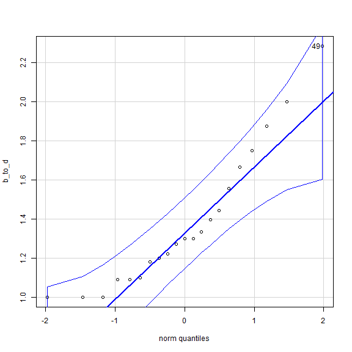

<!-- R Commander Markdown Template -->

PRACTICA 7, TESTS DE NORMALIDAD
=======================

### Your Name

### 2025-06-03


```r
> load("C:/Users/Airam/Downloads/World95R.RData")
```


Usamos la comparacion de cuantiles y el saphiro wilk

ejemplo1
para el mundo95, estudiar normalidad de B_TO_D en OECD
alpha es 0.05
H0: X~(mu,var^2)
H1:X~/(mu,var^2)


```r
> example1 <- subset(World95, subset=region=="OECD")
```


```r
> normalityTest(~b_to_d, test="shapiro.test", data=example1)
```

```

	Shapiro-Wilk normality test

data:  b_to_d
W = 0.89222, p-value = 0.0248
```
We observe in the output that the p-value obtained is 0.0248. Since it is smaller than
the significance (? = 0.05), we reject the null hypothesis and say that this data are nor
normally distributed


```r
> with(example1, qqPlot(b_to_d, dist="norm", id=list(method="y", n=1, 
+   labels=rownames(example1))))
```



```
49 
10 
```


```r
> normalityTest(~b_to_d, test="shapiro.test", data=example1)
```

```

	Shapiro-Wilk normality test

data:  b_to_d
W = 0.89222, p-value = 0.0248
```
We perform the Shapiro-Wilk test again and now obtain a p-value equal to 0.06335,
hence we do not reject the normality at ? = 0.05 significance, once we deleted case 49.


3.Confidence intervals and hypothesis tests for the mean of a normal population

X:quantity of tons of chemical product produced every day
Xhat=802+795+752+810+783/5=788.4

H0:mu=800
H1:mu=/800

como el p-valor es mayor a 0.05, quiere decir que no tenemos suficiente evidencia
a un nivel de confianza del 5% para rechazar H0

```r
> 802+795+752+810+783/5
```

```
[1] 3315.6
```


```r
> 802+795+752+810+783
```

```
[1] 3942
```


```r
> 3942/5
```

```
[1] 788.4
```


```r
> load("C:/Users/Airam/AppData/Local/Temp/RtmpUtSjbB/Example2")
```


```r
> with(Example2, (t.test(tons, alternative='less', mu=800, conf.level=.95)))
```

```

	One Sample t-test

data:  tons
t = -1.146, df = 4, p-value = 0.1578
alternative hypothesis: true mean is less than 800
95 percent confidence interval:
     -Inf 809.9791
sample estimates:
mean of x 
    788.4 
```

4.Confidence intervals and hypothesis tests for paired samples
X:time before
Y:time after
D:X-Y<0?
el p-valor es menor a 0.05, por lo que tenemos suficiente evidencia para rechazar la hipotesis H0

```r
> load("C:/Users/Airam/AppData/Local/Temp/RtmpUtSjbB/Example4")
```


```r
> with(Example4, (t.test(Time.bef, Time.aft, alternative='less', conf.level=.95, 
+   paired=TRUE)))
```

```

	Paired t-test

data:  Time.bef and Time.aft
t = -4.4508, df = 9, p-value = 0.0007992
alternative hypothesis: true difference in means is less than 0
95 percent confidence interval:
      -Inf -5.293262
sample estimates:
mean of the differences 
                     -9 
```

5.Confidence Intervals and Hypothesis tests for a difference in two population means of two normal
independent populations

X:mean of treatment
Y:mean of placebo

H0:X-Y=0
H1:X-Y=/0

Para este, poner bien el conjunto de datos, y luego ir al test de medias independientes, y hacer el test que toca, que te lo da el propio menu


```r
> load("C:/Users/Airam/AppData/Local/Temp/RtmpUtSjbB/Example5")
```


```r
> options(encoding="utf-8")
```


